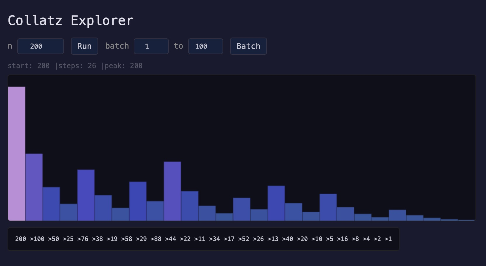

# Collatz Explorer — Dyalog APL

One recursive function. Two endpoints. Interactive frontend. Conga HTTP server.

```apl
Trajectory←{⍵=1:,1 ⋄ ⍵,∇⊃(2|⍵)⌽(⍵÷2)(1+3×⍵)}
```

## Quick Start

```bash
docker build -t collatz-api .
docker run --rm -p 8080:8080 collatz-api

open http://localhost:8080
```

## Endpoints

**GET /trajectory?n=27** — run Collatz on a single number

```json
{ "start": 27, "steps": 111, "peak": 9232, "sequence": [27, 82, 41, ...] }
```

**GET /batch?from=1&to=50** — run on a range (max 500), no sequences

```json
[{ "start": 1, "steps": 0, "peak": 1 }, ...]
```

n capped at 1,000,000. Bad input returns 400.


